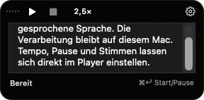
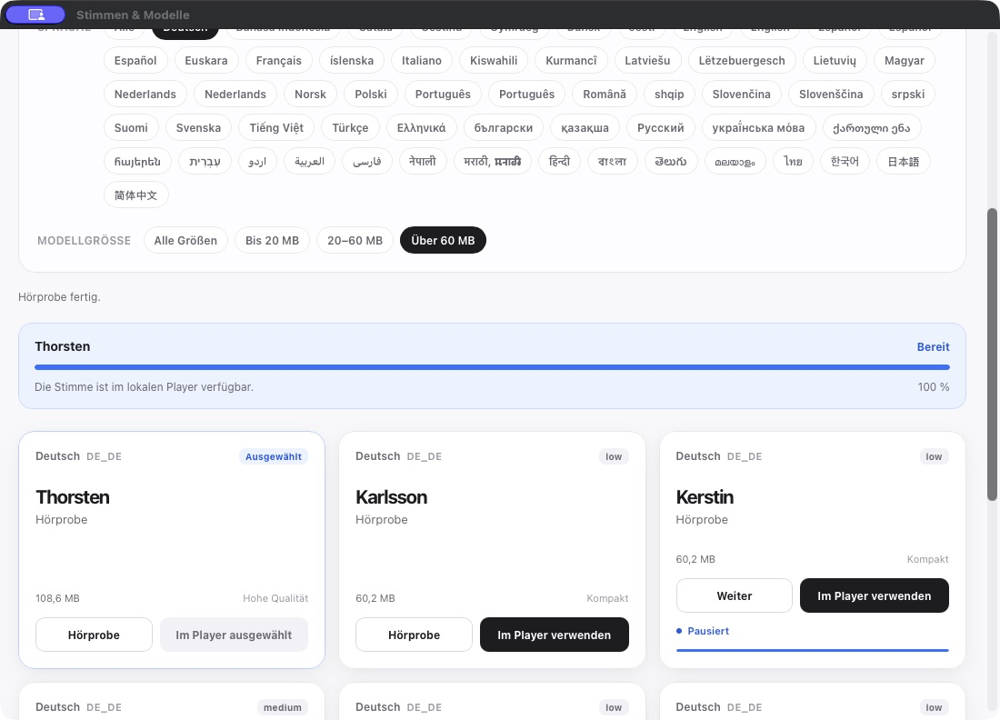

# Generate Audio – lokal auf dem Mac

Kleine lokale Sprachausgabe für macOS: 180 × 32 Pixel, deutsche Standardstimme, gepufferte Erzeugung, lokale OCR und eine Galerie mit 100 fertigen Hörproben.

## Echte App-Aufnahmen

Über Codex Computer Use am installierten Player aufgenommen, keine Mockups.

**Mini-Player**


**Texteingabe**



**Stimmen-Galerie**



## Schnellstart

Voraussetzungen: Apple Silicon (hier geprüft), aktuelle Xcode Command Line Tools, `uv`; macOS 13 oder neuer für den Player und **macOS 15.2 oder neuer für OCR**.

```sh
git clone https://github.com/Martin-Hausleitner/lokal-vorlesen.git
cd lokal-vorlesen
./setup.command
./install.command
open "$HOME/Applications/Lokal vorlesen.app"
```

Die Einrichtung lädt das Modell mit geprüfter SHA-256-Prüfsumme und die festgeschriebene Python-Laufzeit. Für Textzugriff und OCR müssen die entsprechenden macOS-Freigaben der installierten App gültig sein. Nach einem selbst signierten Neubau kann eine erneute Freigabe nötig sein.

Dies ist ein lokales Open-Source-Projekt, kein notarisiertes App-Store-Paket.

## Start bei Anmeldung

`install.command` richtet einen einmaligen Start der installierten App bei der macOS-Anmeldung ein. Die Leiste startet verborgen; die Vorlese-Shortcuts stehen nach dem App-Start bereit. Ein manuelles **Beenden** wird respektiert: kein KeepAlive und keine Neustartschleife.

Für eine bereits installierte App ohne Neubau:

```sh
./autostart.command --enable
```

Der erste Aufruf startet die App auch in der aktuellen Sitzung im Hintergrund. Wiederholte Aufrufe mit unverändertem, bereits geladenem Auftrag starten sie nicht erneut. Zum Entfernen des Autostarts, ohne eine laufende App zu beenden:

```sh
./autostart.command --disable
```

Der benutzerspezifische Auftrag liegt unter `~/Library/LaunchAgents/local.codex.lokalvorlesen.login.plist`. Das App-Bundle wird dabei nicht verändert. `--print` zeigt die erzeugte plist ohne Installation.

## Bedienung

Die Leiste startet ausgeblendet und verschwindet nach drei Sekunden ohne Nutzung. Beim Vorleseauftrag erscheint sie automatisch. Wiedergabe, Pufferung, Pause, offene Einstellungen, Maus über der Leiste und aktive Texteingabe halten sie sichtbar. Über das ▶︎-Menüleistensymbol → **Generate Audio** oder **App-Menü → Player öffnen** lässt sie sich jederzeit zurückholen; **⌘E** öffnet die Texteingabe.

- Text markieren und **Rechtsklick → Dienste → Generate Audio** wählen.
- Mit freigegebener Bedienungshilfe kann die App lesbaren Text am Mauszeiger erfassen und eine eigene **Generate Audio**-Schaltfläche anbieten. Fremde Kontextmenüs bleiben erhalten.
- Die schwarze **180 × 32 Pixel** große Leiste zeigt Start/Pause, Stopp, anklickbares Tempo, einen kleinen Audiopegel und ein dauerhaft erreichbares Zahnrad. Die Schaltflächen bleiben auch beim Darüberfahren an ihrem Platz. Das Tempo von **0,5× bis 4×** bleibt gespeichert. Auf dem Tempo scrollen ändert es in Viertelschritten; Klick öffnet die Auswahl. Scrollen daneben spult innerhalb der bereits erzeugten Audiopuffer vor oder zurück. Beim Darüberfahren erscheint der gerade gesprochene Textabschnitt. **⌘T** oder **Lesetext anzeigen** in den Einstellungen hält ihn während der Wiedergabe und bei Pause sichtbar; erneutes Umschalten blendet ihn wieder aus. Die Textanzeige folgt den Audiopuffern, nicht einzelnen wortgenauen Zeitmarken.
- In den Einstellungen unter **Position → Oben / Unten** wählen. Der Pegel reagiert auf das abgespielte Audio.
- **⌘E** oder **App-Menü → Text eingeben / Texteingabe schließen** klappt das Eingabefeld auf und wieder zu, auch ohne Hover. **Zahnrad → Text eingeben** bietet denselben Weg. **Stimmen & Modelle** öffnet die lokale Hörproben-Galerie in einem eigenen App-Fenster. Alternativ **⌘,** drücken. Im geöffneten Textfeld startet **⌘↩** das Vorlesen und schaltet anschließend zwischen Pause und Fortsetzen um; **↩** allein bleibt ein Zeilenumbruch. Der Fußbereich zeigt den aktuellen Zustand.
- **⌃⌥⌘K** liest die aktuelle Markierung direkt über Bedienungshilfen, ohne Kopieren und ohne vorherigen Fokuswechsel. Die hintere Maustaste wird im Aqua-/OpenLogi-Chat auf diesen Shortcut abgestimmt.
- **⌃⌥⌘O** startet die Bereichsauswahl: Rechteck ziehen, loslassen, lokal per Apple Vision erkennen und vorlesen. Escape bricht ab. Bei fehlender Markierung öffnet **⌃⌥⌘K** ebenfalls die Bereichsauswahl. Bildschirmaufnahme muss für die App erlaubt sein. Bilder werden nicht hochgeladen oder dauerhaft gespeichert.
- Als separater Weg Text kopieren und **⌃⌥⌘L** drücken. Im Zahnrad kann **Kopiertes automatisch vorlesen** eingeschaltet werden; standardmäßig ist es aus. Das liest neue Textkopien, ohne die Zwischenablage zu verändern. Von Apps als vertraulich markierte Kopien werden dabei übersprungen.
- Logitech-Zielbelegung: vorne Aqua mit Enter nach Einfügung, hinten kurz Markierung/OCR-Fallback, hinten lang OCR-Bereich. Die Konfiguration wird mit dem Aqua-Chat abgestimmt. Die tatsächlichen Mauskanten und das Ziehen mit gehaltenem hinteren Knopf sind erst nach einem Hardwaretest bestätigt; normales Ziehen mit links bleibt der Auswahlweg.

Die Erzeugung erfolgt gepuffert in Abschnitten: Der erste Abschnitt spielt bereits, während die nächsten berechnet werden. Im Test standen 38 Sekunden Sprache in 13 Puffern bereit; der erste nach 1,115 Sekunden, alle nach 3,87 Sekunden. Tempoänderungen benötigen keine erneute Erzeugung. Die Schaltfläche am Mauszeiger ist eine eigene Ergänzung; macOS erlaubt keinen allgemeinen zusätzlichen Eintrag in jedem fremden Kontextmenü. Nur Text, den die jeweilige App über ihre Bedienungshilfen bereitstellt, kann dort erfasst werden. Bilder, geschützte Eingaben und manche Zeichenflächen sind damit nicht abgedeckt.

## Modell und Installation

- **Modell:** Piper `de_DE-thorsten-low` INT8, **18.555.534 Byte (18,6 MB)**, Deutsch, 16 kHz, ein Sprecher. Die quantisierte Variante ist etwa 71 % kleiner als das ursprüngliche Modell.
- **Laufzeit:** Piper 1.8.0 / ONNX Runtime auf Apple Silicon, ca. 148 MiB zusätzlich zum Modell. Kein PyTorch und kein Cloud-Dienst.
- Die vorhandene Python-3.12-Installation des Macs wird verwendet. Das App-Bundle verweist auf den `runtime`-Ordner dieses Projekts; den Ordner daher nicht verschieben oder löschen.
- `setup.command` installiert die festgeschriebenen Abhängigkeiten, prüft die Modell-Prüfsummen und baut die App. Nur die Einrichtung benötigt Internet.
- `build.command` baut die App erneut; `install.command` installiert sie in den Programme-Ordner des Benutzers.

Text geht über eine private Standardeingabe an einen lokalen Prozess. Nach abgeschlossener Erzeugung bleibt höchstens eine Stimme für weitere Aufträge geladen; nach fünf Minuten ohne Auftrag beendet sich der Prozess und gibt seinen Speicher frei. Ein Stimmenwechsel oder der Abbruch einer noch laufenden Erzeugung verwirft den Prozess. Bereits fertig erzeugtes Audio lässt sich stoppen, ohne das geladene Modell zu verlieren. Die erzeugte WAV-Datei ist temporär. Es werden keine Texte an einen Server gesendet. Die zerlegte Lautdarstellung `c` plus Cedille wird für den deutschen „ich“-Laut in das vom Modell erwartete `ç` umgewandelt.

## Stimmen-Galerie

Die Galerie bietet **100 fertige Hörproben**, davon neun deutsche Optionen, inklusive Thorsten High. Die App startet die Galerie ausschließlich auf `127.0.0.1:8769`. Hörproben sind veröffentlichte Beispielaufnahmen; dafür ist Internet nötig. **Im Player verwenden** lädt nur das ausgewählte Modell, prüft es und übernimmt es für das nächste Vorlesen. Bereits erzeugtes Audio läuft mit seiner bisherigen Stimme weiter. Der Standard Thorsten INT8 bleibt ohne zusätzlichen Download verfügbar. Die unterstützte lokale Spracherzeugung benötigt nach dem Modelldownload kein Internet. **96 Optionen sind zur lokalen Auswahl freigegeben; vier sind ausdrücklich nur Hörproben:** Japanisch, Litauisch, Thailändisch und die chinesische Stimme Chaowen benötigen zusätzliche oder neuere Sprachunterstützung. Für Chinesisch steht Huayan zur lokalen Auswahl bereit. Hebräische Lautumwandlung wurde mit dem vorhandenen Paket geprüft. Arabisch verwendet keine automatisch nachgeladene Vokalisierung; dies kann die Aussprache unvokalisierter Texte beeinträchtigen. Nicht alle 96 Modelle wurden heruntergeladen und vollständig synthetisiert.

Stimmwahl und Playerposition werden im benutzerspezifischen Application-Support-Ordner gespeichert. Ein Wechsel während eines Downloads wird abgewehrt. Fremde Origins und Hostnamen sowie unbekannte Stimmenkennungen dürfen die Auswahl nicht ändern.

## Ressourcen und Wiederanlauf

Die wiederverwendete Sprachengine benötigt zusätzlichen Arbeitsspeicher, solange sie bereitsteht. Im lokalen Backend-Test lag die RSS-Stichprobe bei etwa 164–183 MiB einschließlich Python, Sprachverarbeitung und Modell; das ist kein garantierter Höchstwert. Nach fünf Minuten ohne Syntheseauftrag endet sie automatisch.

Die aktive Erzeugung/Wiedergabe wird als zeitkritische Nutzeraktivität angemeldet; der Syntheseprozess verwendet User-Initiated-QoS. Es werden keine globalen Systemeinstellungen oder fremden Prozesse verändert.

Wenn vor dem ersten Audiopuffer 30 Sekunden lang keine Ausgabe startet, wird ausschließlich dieser Syntheseauftrag einmal neu gestartet. Zwischen automatischen Versuchen liegen mindestens 120 Sekunden. Hängt auch der Wiederholungsversuch oder ist die Wiederanlauf-Sperrzeit noch aktiv, wird der Auftrag mit einer Fehlermeldung beendet. Auch ein späterer Pufferstillstand von 30 Sekunden endet kontrolliert; bereits gehörter Text wird dabei nicht automatisch wiederholt. Laufendes oder pausiertes Audio und eine OCR-Auswahl werden nicht dafür abgebrochen. Ein beendeter Galerieprozess darf höchstens dreimal pro App-Sitzung mit jeweils mindestens 60 Sekunden Abstand neu starten. Beim Beenden bekommen verbliebene Kindprozesse zwei Sekunden für einen normalen Abbruch, anschließend werden sie nötigenfalls erzwungen beendet. Ein blockierter macOS-Hauptthread oder ein Hardwarefehler wird damit nicht vollständig überwacht.

## Entwicklung

Der wiederverwendete Worker wird nur für den nativen Player eingesetzt. Der bisherige CLI-Aufruf bleibt als separat messbarer Vergleichspfad erhalten. Bei einem Abbruch während der Erzeugung wird der Worker beendet; nach abgeschlossener Erzeugung kann derselbe Prozess den nächsten Auftrag übernehmen.

```sh
./build.command
./tests/run.command
```

Reproduzierbare Laufzeitmessungen: [Benchmark-Anleitung](benchmarks/README.md). Sie trennt den ersten beobachteten Prozess von nachfolgenden Prozessen und dokumentiert Cache- und Messgrenzen.

## Quellen und Lizenzen

Der eigene Quellcode steht unter **GPL-3.0**; siehe `LICENSE`. Stimmen und Fremdkomponenten behalten ihre jeweiligen Lizenzen.

- [Piper](https://github.com/OHF-Voice/piper1-gpl), GPL-3.0; Lizenzkopie unter `licenses/`.
- [Thorsten Low Modell](https://huggingface.co/rhasspy/piper-voices/tree/main/de/de_DE/thorsten/low); die Modellkarte nennt CC0 für den Datensatz.
- [Offizielle INT8-Version](https://github.com/k2-fsa/sherpa-onnx/releases/download/tts-models/vits-piper-de_DE-thorsten-low-int8.tar.bz2) aus den sherpa-onnx-Modellveröffentlichungen; funktioniert hier direkt mit Piper.
- [Thorsten Voice](https://github.com/thorstenMueller/Thorsten-Voice).

## Prüfung

Die lokale Synthese wurde mit durch macOS gesperrtem Netzwerk erfolgreich ausgeführt. Leere Eingaben, überlange Eingaben und Überschreiben vorhandener Audiodateien werden abgewehrt. Die Messungen sind Einzelmessungen auf diesem Mac, keine allgemeinen Leistungsversprechen.

Der native 4×-Audiopfad wurde praktisch geprüft: 9,424 Sekunden Quelle liefen in 2,559 Sekunden bis zum Abschluss. Die Tests sichern Pufferpause, verspätete OCR-Ergebnisse, begrenzten Wiederanlauf, Spulen im vorhandenen Player und verspätete Generierungsabschlüsse. Hinzu kommen sieben Benchmarktests, sechs Python-Worker-Tests und ein nativer Integrationstest mit echtem Modell für Prozesswiederverwendung, Stimmenabgrenzung, Abbruch und erzwungenes Beenden eines SIGTERM-ignorierenden Testprozesses.

Am 27. September 2026 über Codex Computer Use geprüft: 180 × 32 Pixel großer Player, Texteingabe und Wiedergabe, Tempoänderung durch Scrollen, Stimmen-Galerie, Thorsten-Hörprobe sowie Download und Auswahl von Eva K. Beim aktuellen GUI-Test startete der erste Audiopuffer nach 1,413 Sekunden. Bedienungshilfe wurde nach Erneuerung ihrer Signaturbindung von der App als gültig erkannt. Die OCR-Auswahl öffnet sich mit Bildschirmaufnahme-Freigabe; Escape beendet sie.

Ein anschließender unabhängiger Computer-Use-Test bestätigte Bildschirmbereich → Apple-Vision-Texterkennung → Player-Wiedergabe bis zum Abschluss. Der erste Audiopuffer startete 1,081 Sekunden nach dem Syntheseauftrag. Dafür musste das Testtextfenster tatsächlich in den Vordergrund gebracht werden; eine isolierte App-Aufnahme allein garantiert das nicht. Menschlich gehörte Ausgabe ist damit nicht belegt.

Die spätere Bedienprüfung bestätigte außerdem die Auswahl von 4×, Wechsel in den pausierten Zustand mit Fortsetzen-Schaltfläche, Stopp sowie Scroll-Spulen außerhalb des Tempoelements (GUI-Ereignis `seeked`). Für den damaligen Stand noch nicht vollständig praktisch bestätigt: Hover-Textanzeige sowie die echten kurzen und langen Logitech-Maustastendrücke. Erfolgreiche Synthese allein belegt keinen appübergreifenden Rechtsklick-Ablauf und keine subjektive Stimmqualität.

### Wiederverwendung im installierten Player

Am 27.09.2026 lief derselbe neutrale Testtext zweimal im sichtbaren Player: erster Puffer nach 1,199 s beim ersten Auftrag und nach 0,302 s beim Folgeauftrag. Beide Aufträge endeten erfolgreich und verwendeten nachweislich dieselbe Worker-Prozesskennung. Ein weiterer Lauf bestätigte Pause und Stopp. ⌘E klappte das Textfeld ein; der Menüpunkt öffnete es wieder. Die strenge Code-Signaturprüfung bestand auch nach der Wiedergabe. Die Angaben beschreiben den Player-Audiopfad, keine durch ein Mikrofon gemessene Lautsprecher-Latenz.

### Kompakte Bedienung

Die anschließende UI-Runde hält die Leiste dauerhaft bei **180 × 32 Pixeln**; das Zahnrad bleibt erreichbar, ohne die Schaltflächen beim Darüberfahren zu verschieben. Die Wartephase nutzt eine separate Ladeanzeige; der Pegel bleibt an tatsächliches Audio gebunden. Lesetext lässt sich mit **⌘T** anheften und wird bei verstecktem Player oder beendeter Wiedergabe ausgeblendet. Ein zusätzlicher nativer Test prüft diese Sichtbarkeitsregeln einschließlich Pause.

Die installierte Version wurde über Codex Computer Use auf Zahnradmenü, Eingabe, Einklappen, Wiedergabe bei 4× und Pause/Fortsetzen bei 1× geprüft. Der persistierte Lesetext-Schalter reagierte auf ⌘T; die separate Paneldarstellung wurde vom verfügbaren Mac-Fensteraufnahmeweg nicht eindeutig erfasst und bleibt visuell unbestätigt. Die letzten GUI-Messungen ergaben 1,294 s bis zum ersten Puffer und 0,416 s bei einem Folgeauftrag; keine kontrollierte Cache- oder Akustikmessung.

### Klarere Eingabe und Menüs

Die Tempoanzeige nutzt jetzt kurze deutsche Werte wie **1×**, **1,25×** und **4×**. Das Zahnrad öffnet ein kompaktes Einstellungsfenster mit Status, Stimme, Vorleseaktionen und Position Oben/Unten. Stopp ist im Leerlauf deaktiviert. Das Textfeld enthält eine sichtbare Statuszeile und den Hinweis auf **⌘↩**. Lange Statusmeldungen sind zusätzlich vollständig als Tooltip zugänglich.

Am 27.09.2026 wurde der installierte Build über Codex Computer Use geprüft: sichtbarer Footer, normaler Zeilenumbruch mit Return, Start und sofortige Pufferpause mit ⌘Return bei 0,5×, Stopp, Rückkehr zu 4× und Einklappen mit ⌘E. Die bestehende Test-Suite und der Build bestanden ebenfalls.

### Ausfallsicherheit

Die zusätzlichen Fehlerprüfungen verwenden echte isolierte Kindprozesse für beschädigte oder abgeschnittene Protokollantworten, abruptes Prozessende, geschlossene Ausgabe und übergroße Antworten. Veraltete Abschlussmeldungen dürfen einen neuen Auftrag nicht beenden. Ein blockierter Prozess zwischen Audiopuffern wird ohne Blockierung des Aufrufers beendet; verspäteter Abschluss nach bereits fertiger Wiedergabe darf den Text nicht erneut starten.

Fünf zusätzliche Downloadtests prüfen mit lokalen Netzwerk- und Engine-Ersatzobjekten: Verbindungsabbruch, unvollständige Datei, falsche Prüfsumme, gleichzeitige Auswahl, Beenden während Download/Modellprüfung und einen erfolgreichen erneuten Versuch. Die vorhandene Stimmwahl bleibt bei Fehlern erhalten. Diese Tests sind keine Prüfung aller Stimmen oder physischer Maustasten.


### Opus-QA und aktuelle Abnahme

Das frühere abgeschnittene Zahnradmenü wurde nach einer unabhängigen Opus-Prüfung durch ein gruppiertes Einstellungs-Popover ersetzt. Beenden bleibt im App-Menü; das Zahnrad sitzt auch bei aufgeklappter Eingabe rechts. Das Tempomenü wird an die sichtbaren Bildschirmgrenzen angepasst.

Opus 5.5 bewertet den Code nach der Korrektur als **PASS**. Die anschließende Computer-Use-Prüfung bestätigte zweiter Zahnrad-Klick → geschlossen, Escape → geschlossen sowie den gespeicherten Wechsel nach Unten. Am installierten Build wurden bei 2,5× erfolgreiche Wiedergaben bis zum Abschluss, Pause, Stopp und das Öffnen der Stimmengalerie beobachtet. Beide macOS-Freigaben passen zur installierten Signatur.

**Visuelles Gate noch offen:** Der verfügbare Mac-Aufnahmeweg erfasst das Elternfenster, nicht das separate Popover. Native Screenshot-App-Versuche endeten mit einem Tool-Timeout. Daher sind die vollständige Popoverdarstellung, alle Tempoeinträge an beiden Bildschirmkanten und das Schließen durch einen echten Klick in eine andere App noch nicht abschließend bestätigt. Die drei obigen Bilder zeigen tatsächlich erfasste App-Fenster. Es wird keine vollständige Hardware-E2E-Abnahme behauptet.

Nachweise: [Fehlertests und 50er-Lauf](docs/validation/README.md), [Opus vorher](docs/validation/opus-ui-qa-before.md), [Opus nachher](docs/validation/opus-ui-qa-after.md).
